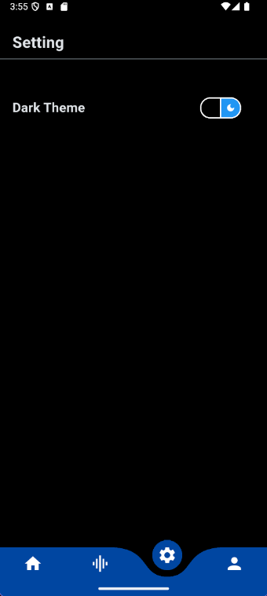

# Assignment - Finance App

A Flutter-based finance and trading application that provides a user-friendly interface for managing orders, viewing market data, and customizing themes.

## Features

- **Dashboard**: View open orders and key financial metrics
- **Navigation**: Curved bottom navigation bar for easy access to different sections
- **Theme Support**: Toggle between light and dark themes
- **Customizable UI**: Personalized experience with user profiles and settings
- **Market Tools**: Access to market watch, portfolio, and exchange files

## Screenshots

| Home Screen (Light Theme) | Home Screen (Dark Theme) |
| :---: | :---: |
|  |  |
| Settings Screen (Light Theme) | Settings Screen (Dark Theme) |
| :---: | :---: |
|  |  |
| Drawer (Light Theme) | Drawer (Dark Theme) |
| :---: | :---: |
|  |  |
| Popup Menu (Light Theme) | Popup Menu (Dark Theme) |
| :---: | :---: |
|  |  |

## Installation

1. **Prerequisites**:
   - Flutter SDK (version 3.8.1 or higher)
   - Dart SDK
   - Android Studio or VS Code with Flutter extensions

2. **Clone the repository**:
   ```bash
   git clone https://github.com/akashverma55/Assignment.git
   cd assignment
   ```

3. **Install dependencies**:
   ```bash
   flutter pub get
   ```

4. **Run the app**:
   ```bash
   flutter run
   ```

## Usage

- **Navigation**: Use the curved bottom navigation bar to switch between Home, Stock, Settings, and Profile sections.
- **Theme Toggle**: In Settings, toggle between light and dark themes using the theme switch.
- **Orders**: View and manage open orders from the Home screen.
- **Search and Filter**: Use the search and filter icons on the Home screen for quick access.

## Technologies Used

- **Flutter**: Cross-platform UI framework
- **Dart**: Programming language
- **Provider**: State management
- **Curved Navigation Bar**: Custom navigation component

## Project Structure

```
lib/
├── main.dart          # Entry point of the application
├── Data/
│   ├── data.dart      # Sample data for orders
│   └── notifier.dart  # Theme state management
└── Screen/
    ├── home.dart      # Home screen with orders and dashboard
    ├── settings.dart  # Settings screen with theme toggle
    └── Widgets/       # Reusable UI components

assets/
├── fonts/            # Custom fonts for the app (Playfair)
└── images/           # Icons and other UI assets
```

## Assets

- **Images**: Icons and UI assets in `assets/images/`
- **Fonts**: Custom fonts (Playfair) in `assets/fonts/`

## Contributing

1. Fork the repository
2. Create a feature branch
3. Commit your changes
4. Push to the branch
5. Create a Pull Request

